# Responsive Design and Technology Task 2 #
### Mobile Web App That Displays An Overview Of Key Components When Sailing a Boat ###

## 1. Conceptualisation ##
### 1.1 Design Intent ###
Summary: A web app that can be used by a user through a website address, then asking for permission to use the user's phone/device's permission to use certain components for input. As a result, the web app will then be able to produce an output displayed on the screen to the user. Lastly, it is key as prior knowledge that this web app can be used for anything boat related due to the the app utilising certain APIs from the user's phone while sailing. It should also be noted that a boat involved activity is not the only situation when this web app can be used, other examples could include using the web app while mountain biking, flying, snowboarding, etc.

### 1.2 Research ###
Through using research of other similiar projects found on the web, it has helped to gain a deeper understanding of what myself, Sean, and Jay are aiming to achieve for the project, along with how we are going to do it. Research found during this phase will greatly affect what we aim to create paired with each phase during development. This will include how we develop the web interface, how this interface communicates with the user's phone, and what informational components of the user's phone we are aiming to extract data from? The influence of this research will be seen more apparent later within this process journal.

### 1.2.1 Related Project 1 ###

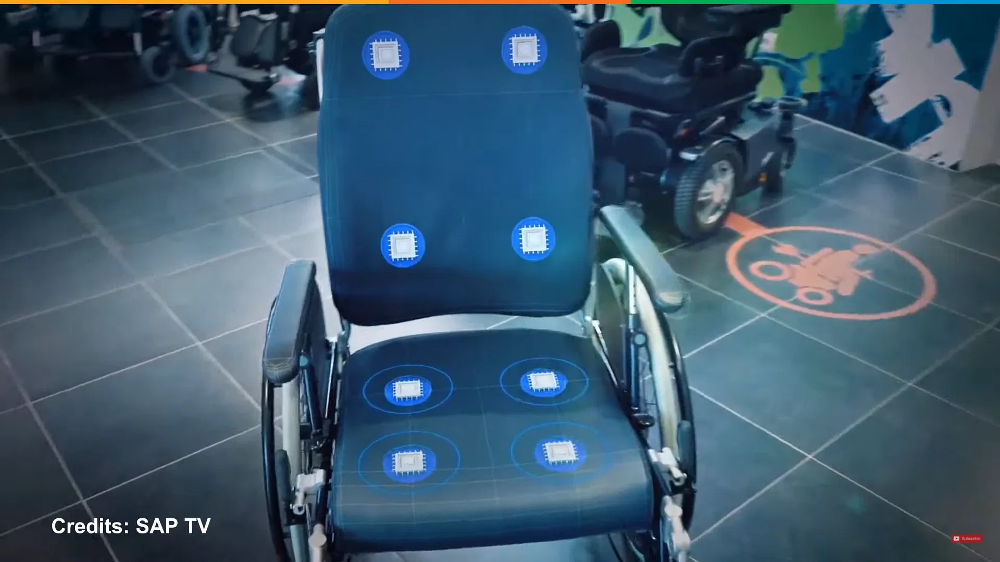

This project utilises a similiar concept as the concept we have devised ourselves. However, differences with the smart wheelchair incldue that the wheelchair iteslef comes with built-in sensors on the seat, collecting data every second in the background of the patient using the wheelchair. Data collected from this wheelchair then provides insight into the patient's seatin behaviours and the energy the patient requires in order to maintain correct posture. Another possible variation to this smart wheelchair could be to adapt fall detection so that the patient in the wheelchair knows when the wheelchair could possibly fall, giving time to call for assistance. These key features of the smart wheelchair then allow people to monitor the patient from a remote location, or more realistically when they are out of reach from that patient. A Possible idea from this project that could be interpreted into ours is being able to remotely access the data obtained, no matter where you are.

**Reference:** Deshpande, C. (2020, December 21). Top 10 Ultimate Internet of Things (IoT) Projects. Simplilearn.com. https://www.simplilearn.com/internet-of-things-iot-projects-article

### 1.2.2 Related Project 2 ###

The following project integrates a smartphone application designed to estimate road conditions using data from the accelerometer, gyroscope, and GPS. According to the research, machine learning techniques are applied to predict road quality based on this data. By leveraging the RoadSense app, the need for specialized vehicle sensors was eliminated, making the solution more scalable. The goal of the app is to provide users with real-time information on road conditions before they travel, potentially contributing to improved road infrastructure. The study highlights that combining data from the gyroscope and accelerometer proved to be the most effective approach, as these sensors can detect vehicle movements caused by potholes, rough surfaces, and other road irregularities. This insight is highly relevant to our project, as the accelerometer and gyroscope are effective in detecting sudden movements such as shakes, bumps, and tilts. These factors are essential characteristics of bike and motorbike usage, potentially making these sensors highly beneficial for advancing our project. 

**Reference:** Allouch, A., Koubaa, A., Abbes, T., & Ammar, A. (2017). RoadSense: Smartphone Application to Estimate Road Conditions Using Accelerometer and Gyroscope. IEEE Sensors Journal, 17(13), 4231–4238. https://doi.org/10.1109/jsen.2017.2702739

### 1.2.3 Related Project 3 ###

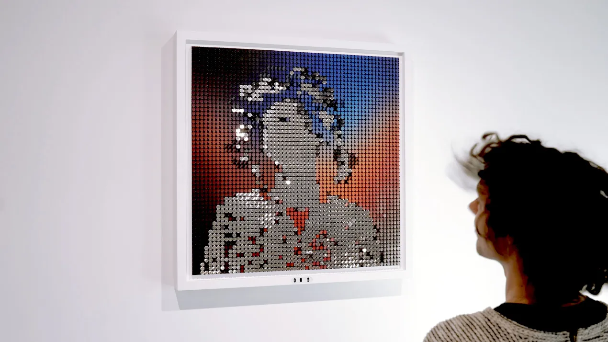

The third related project utilises the use of a camera in order to mimic the appearance of the user of the artwork, a similiar ideology of a mirror, but instead of a refelction the artwork uses flip-discs (small dime-size circles that can rotate 60 times per second usining electromagnets). Portraits Nebula is the name of the artwork and is summarised as an interactive kinetic artwork that uses customised flip-discs, when you engage with the artwork it will use a camera to record a breif clip of the interactions the user performs while being recorded. It then plays these cpatured interactions at a later time, eventually cycling through every portrait captured while the artwork/device has been initiated. In relation to our web app project, the artwork utilises the advantage of a camera in a similiar approach to our design which could possibly include snapshotting/recording interactions the user performs while using the web app.

**Reference:** Digital Kinetic Artwork - Portraits by BREAKFAST. (2024, July 16). BREAKFAST. https://breakfaststudio.com/works/portraits-nebula

### 1.2.4 Related Project 4 ###
‌
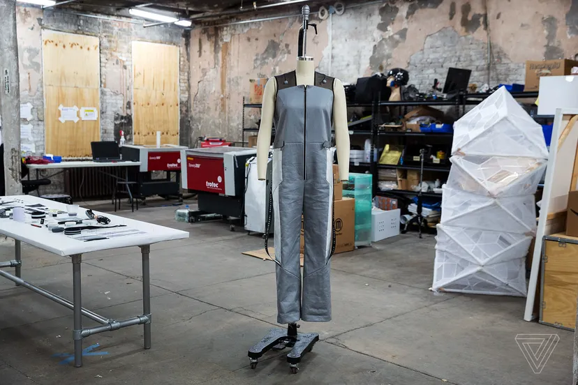

As seen above, the name of the suit is Ceres and it is a grey, jumpsuit like wearable technology that from afar looks like it just randomly vibrates as the user walks around with the jumpsuit on. However, in more detail the jumpsuit is equipped with small buzzers located near the user's shoulder blades and back, providing a buzz like sensation to the user's skin. The contributor as to why these buzzers are occuring on the users shoulder blades and back is due to the jumpsuit having microcontrollers connected to NASA's Near Earth Object API where these vibrations are indications of asteroids nearing Earth's orbit. It is quite clear that this related project is an example of how you can use geographic location of anything to then display in another form, with this example it is showing how the use of NASA's API obtains the geographic locations of asteroids near Earth's orbit, indicated by the jumpsuit lighting up and vibrating. With an example like this, it shows how open minded you can be in regards to using geographic location as a means to display any other form of responsive design. In relation to our project, an extended possibility using geographic location could be having the users phone record tracks and paths the user follows for furutre reference through similiar use with an API.

**Reference:** Plaugic, L. (2018, April 14). These three designers make wearables that measure the world around you. The Verge. https://www.theverge.com/2018/4/14/17233430/wearable-media-fashion-tech-nyc-ceres-jumpsuit-interactive

### 1.2.5 Related Project 5 ###

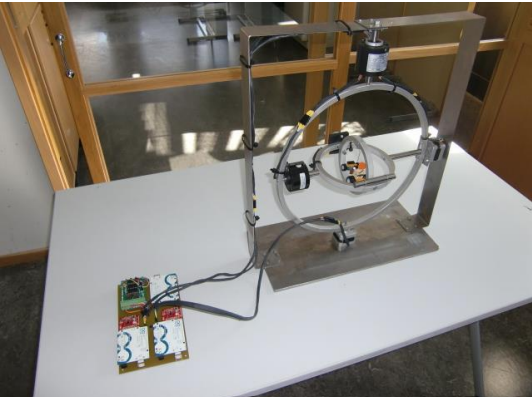

Implementation of a gyroscope was created which could rotate 360 degrees in all dimensions, being controlled with a software-GUI paired with some type of joystick. Implementation of this project consists in the field of simulators such as a plane simulator, the design focuses on a gyroscopic view paired with software development, the prototype is more so seen as an idea for future investors who wish to apply this theology with a full scale, real-time used model, being much larger in price and scale. Regarding our project, this ideology can be used when considering the use of a gyroscope with the design, it will be viewed as treated in a similiar manner as seen in this example. The key difference however would be the implmentation of this gyroscopic use being obtained from the user's phone which then displays the user's tilt angle on the web app. In future development there could also be more extended use with a gyroscope such as utilising it for gesture-based navigation, motion controls, integrated augmented reality features responding to the user's movements, and etc.

**Reference:** Svensson, M. and Johannesson, J. (2013). The Human Gyroscope. [PDF] p.45. Available at: https://www.diva-portal.org/smash/get/diva2:647956/FULLTEXT01.pdf [Accessed 8 Sep. 2024].

### 1.2.6 Related Project 6 ###

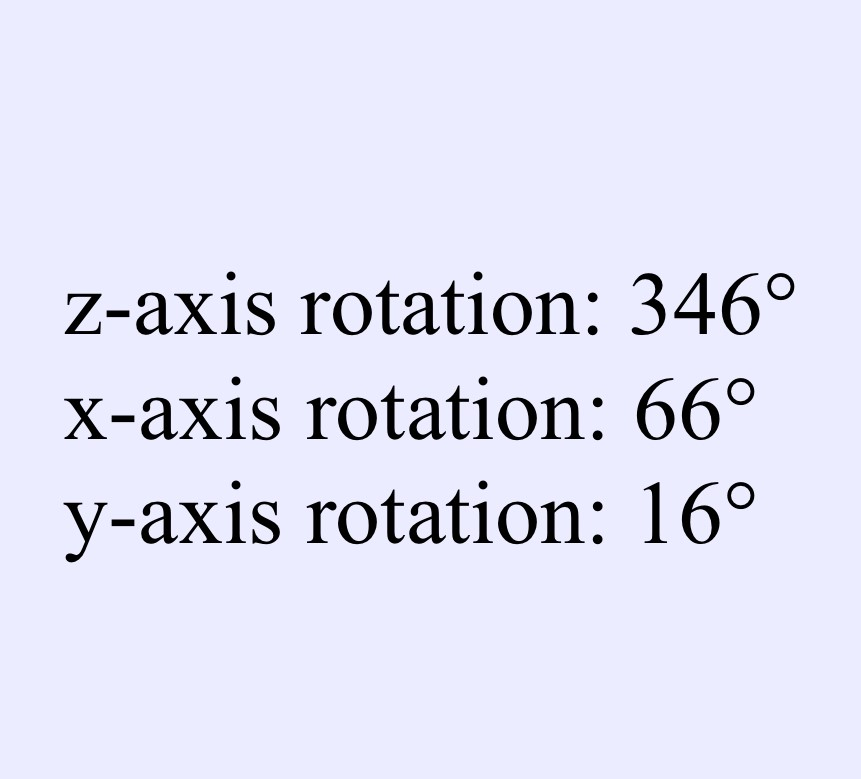

The above image displays a simple web page that displays the z-axis, x-axis, and y-axis of the user's phone once permission has been granted to use the device's hardware. An Inertial Measurement Unit (IMU) is used for the webpage, an IMU combines 3-axis accelerometers with 3-axis gyroscopes, and sometimes 3-axis magnetometers to then get a more accurate display of the device's orientation. On top of this, the IMU used does onboard analysis, combining these different sensors applied with signal processing to then produce a smooth and useful signal as the final output. The way this API works is that an event listener is added and listens for the event type 'deviceorientation', the event itself contains three variables represetning the z-axis, x-axis, and y-axis. From this the event handler then simply updates the text readouts of these rotation values as a web app. This API is highly valuable for our project, as one of our core components(being the gyroscope) relies directly on the Device Orientation API, together with geographic location and camera functionality, the gyroscope forms a key element of our web app's design. It is most likely that this Device Orientation API will be used in our project as it meets exactly the needs we require for the gyroscope aspect of the web app, however, we will then try to edit and improve this API's functionality and appearance to better suit our web app's needs.

Here is the link to access the live web app: https://tgifford-usc.github.io/WebAPIExamples/

**Reference:** Log In to Canvas. (2024). Usc.edu.au. https://learn.usc.edu.au/courses/27670/pages/8-dot-2-%7C-device-orientation-api?module_item_id=632692

### 1.2.7 Related Project 7 ###

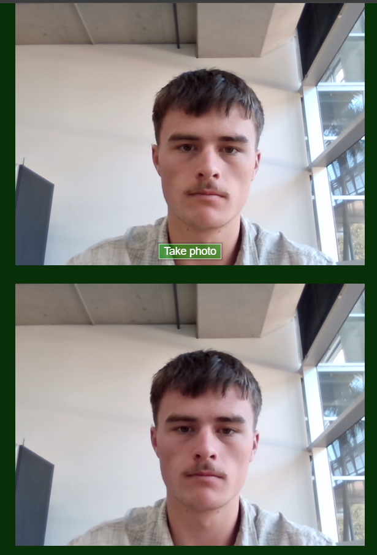

Similiar to Related Project 6, this image showcases another simple web page but instead it displays a live camera (top) that when the 'Take photo' button is pressed, the web page takes a photo of the user and displays the photo in a static form (bottom). However, this web page doesn't save the photos and only holds the most recent photo taken once the 'Take photo' button has been triggered. This webpage operates by treating the device's cameras as video cameras, generating a live video stream directly from the camera. 
The process begins by using the Media Capture API to access the camera's video stream. This stream is then attached to an HTML video element, allowing for the display of the live feed, extraction of individual frames, or both. A final step involves rendering a captured video frame onto an HTML canvas element, converting it to an image format, such as PNG. From there, the captured frame can be manipulated or processed in any desired way. In relation to our mobile web app, the Media Capture API will also most likely be used due to the API showcasing very similiar results to what we are aiming to design for the web app. However, this API will be modified and adapted to better suit the needs of our web app, but it is hard to tell what these changes could include to the Media Capture API as of this stage in the design.

Here is the link to access the live web app: https://tgifford-usc.github.io/WebAPIExamples/

**Reference:** Log In to Canvas. (2024). Usc.edu.au. https://learn.usc.edu.au/courses/27670/pages/8-dot-3-%7C-media-capture-api?module_item_id=632693

### 1.2.8 Related Project 8 ###

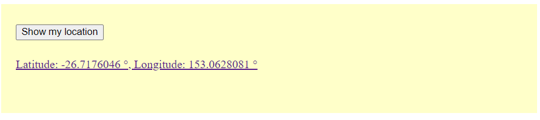

Once again another API is being used here, however, this time it is the use of a Geolocation API that displays your current latitude and longitiude once the 'Show my location' button has been pressed on a simple web app. This web page is extremely simple just like the last two APIs, leaving a lot of room to add and customise the API to better suit our web app project. The way this API works is that the user's location is described using the GeolocationPosition object instance, which contains a GeolocationCoordinates object instance inside. There are only two things contained within the Geolocation instance, a coords property which includes the GeolocationCoordinates instance and a timestamp property holding a timestamp (given as Unix time in milliseconds of when the position data was obtained). Inside the GeolocationCoordinates instance there are a number of properties, but the two being used are the latitude and longitude, other bits of information you can obtain from the GeolocationCoordinate's object include altitude, speed, what direction the device is facing, and accuracy measures of the altitude, longitude, and latitude data. For our web app project, this API satisfies the requirements for geographic location functionality but will need adjustments and modifications to align more closely with our desired outcomes, additionally it must be optimized to integrate seamlessly with the rest of our web app.

Here is the link to access the live web app: https://developer.mozilla.org/en-US/docs/Web/API/Geolocation_API/Using_the_Geolocation_API

**Reference:** Using the Geolocation API Web APIs, MDN. (n.d.). Developer.mozilla.org. https://developer.mozilla.org/en-US/docs/Web/API/Geolocation_API/Using_the_Geolocation_API

### 1.3 Other Research ###
The following paragraph relates directly to this video:



(https://www.youtube.com/watch?v=wPpuBOSU7_w)

Further research into how a gyroscope in a smartphone works reveals that its primary function is to measure the device's angular velocity, which means it tracks rotational angles over time. Although this concept is simple in theory, its practical applications in smartphones are vast. For instance, the gyroscope is used for functions like straightening photos during editing, improving low-light photography through optical image stabilization, and enhancing augmented reality experiences by accurately displaying objects in a given environment. In summary, the gyroscope tracks changes in the smartphone's angular velocity, enabling a wide range of functionalities that rely on motion and orientation, leading to a wide variety of endless opportunities using a gyroscope.

### 1.4 Possible Design Concepts ###

### Design Concepts Towards Location API ###
From obtaining the user's location, the web app could work in relation to travelling and maps, telling the user where their current location is on a map. Another possibililty could be to use the phones location to find something, this would be very similiar to Apple's air tag product in a sense or the find my iphone app. A phones location could also be used in a sense for finding what's near the phone istelf, such as locating restaurants near your current location. Lastly, location from the user's phone could be used to store things based on the location, such as geotagged photos, memories, or sounds.

**Pros:** Obtaining the user's location means a web app can offer real-time mapping to help users navigate or find their current location. This can also enable tracking of lost objects and provide personalised, location-based recommendations for nearby places. Additionally, location data can be used for geotagging, allowing users to store and organise memories based on where they were created.

**Cons:** Use of location data in a web app can lead to privacy concerns due to users feeling uncomfortable sharing their current whereabouts. This can also drain battery life and pose security risks if the data is leaked or hacked. Inaccurate location data, such as in areas with poor GPS signal, can lead to unreliable information. Lastly, frequent permission requests regarding location access has the ability to frustrate users, leading to less app use.

### Design Concepts Towards Camera API ###
With using the user's camera, the web app can have the ability to take photos or videos either with the user's input or automatically without. Scanning of QR codes is another possibility that can be achieved through obtaining the user's camera. A more discrete feature that could be used within the web app could be for the user to either check their face or body through using the device's camera. The phone's camera can also be used as a telescope in a sense as well if used within the right context or it could even be used for obtaining colour schemes from pictures such as taking a photo of a susnet or a painting.

**Pros:** There are various benefits from using the camera of a device, these can include allowing the user to capture photos or videos either manually or automatically, giving flexibility for creative and practical purposes. It can also enable scanning of QR codes to quickly obtain information/payments, the camera can also serve as a personal tool in relation towards checking one's face or body. Versatility of the camera allows it to function like a telescope bringing magnified views, or even as a tool towards extracting colour schemes from images to enhance creative and design possibilities.

**Cons:** Just like obtaining the user's location, using the camera also raises privacy concerns, especially in relation to automatic photo or video captures. Camera access can pose high security risks if not properly secured, these risks can include unauthorised recordings or surveillance. Asides from privacy concerns, use of the camera will also drain battery life much like the location API. On top of this, misuse or unintended camera functions can lead to accidental content creation, leading to user dissatisfaction.

### Design Concepts Towards Gyroscope API ###
The last API use will be in relation to the gyroscope, where the gyroscope's benefits can include obtaining the device's level status from it's inbuilt gyroscope. It can also be used for 3D scanning or photogrammetry through ensuring an accurate orientation, which then improves capture stability and facilitates the creation of precise 3D models from multiple angles. Very similiar to the purpose of a gyroscope in 3D scanning and photogrammetry, it can also help to stabilise the use of the phone's camera. A gyroscope can even be used for augmented reality viewing such as NightSky, which is a stargazing reference app, where the user can explore a virtual representation of the night sky to identify stars, planets, constellations and satellites. Lastly, another design concept towards the gyroscope could be to include a shaking functionalitiy such as 'shake to play' or 'shake to win', which can be used to build up anticipation for the user or to create a random outcome.

**Pros:** Many benefits include providing the device's level status for usage needing a precise positioning or balance. Gyroscopes greatly benefit 3D scanning and photogrammetry through ensuring accurate orientation and stability. It also stabilises the phone's camera to enhance image and video capturing. Accurate movement tracking is enabled in augmented realities with the use of a gyroscope. A gyroscope can even bring greater engagement through interactive features, better improving the user experience.

**Cons:** Due to the gyroscope's reliance with device movement and orientation tracking, it can lead to inaccurate result if the sensor itself isn't calibrated correctly or if there is excessive shaking and instability. Once again battery life is also a concern if the gyroscope is continually used over an excessive time frame. Integrating a gyroscope functionallity has the ability to detract the user's overall experience and will require careful, thoughtout design.

### Ways Of Using A Screen ###
There are various ways to interact with screen-based apps. One common method is to gather information, such as using search engines like Google or Firefox. Another use is to communicate with others, either individually or in groups, through apps like Instagram, Facebook, or Snapchat. Screens are also used for financial transactions, such as mobile banking or payments via apps like PayPal or traditional banking apps. The possibilities for using a screen are nearly limitless, with apps offering a range of functions that can combine multiple features or focus on a single purpose. Ultimately, how a screen is used depends on the user's needs and the task they are trying to accomplish.

### 1.5 Double Diamond Design Methodology (Discover and Define) ###
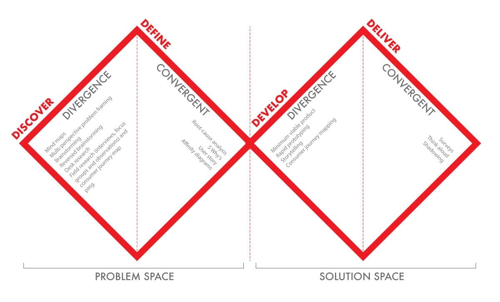

**Reference:** Elmansy, R. (2021, February 9). The Double Diamond Design Thinking Process and How to Use it. Designorate. https://www.designorate.com/the-double-diamond-design-thinking-process-and-how-to-use-it/

### Discover ###
During the discovery stage, the most effective approach to creating a final idea is to develop multiple concepts. By exploring different options, you can compare and refine these ideas, synthesizing the best elements from each to form a cohesive final solution, which will then serve as the main concept or project.

The primary objective of this discovery phase is to gain a deeper understanding of the problem at hand by gathering insights and exploring the broader context surrounding the design challenge (UXPin, 2022). A crucial part of this phase involved researching examples of how similar APIs such as the camera, location, and gyroscope are used across various devices. Several key concepts emerged from Related Projects 2, 3, and 4, each offering unique perspectives. From Related Project 2, the idea of utilising the gyroscope and location APIs to assess real-time map conditions and path quality was particularly influential. Related Project 3 offered insights into leveraging the camera API to record user interactions with the web app for future playback. Lastly, Related Project 4 provided inspiration for using APIs to track and display users' paths on the web app via their smartphones.

In conclusion, these potential ideas will be further analysed and synthesised, incorporating key elements from each project to develop a web app that effectively uses the camera, location, and gyroscope APIs to enhance user interaction and engagement.

**Reference:** UXPin. (2022, September 19). Double Diamond Design Process – The Best Framework for a Successful Product Design. Studio by UXPin. https://www.uxpin.com/studio/blog/double-diamond-design-process/

### Define ###
During this stage, the most important and vital aspects in relation to the project are selected and refined to best meet the projects requirements.

Key Questions to answer in the define phase:

    -What is the purpose of this project?

    -Why is this web app needed?

    -Who will be using this web app?

    -What is the scope of this project?

    -How will this project be implemented?

    -What problems does this project aim top solve for the users?

    -What are the constraints and limitations for this web app?

    -When will the web app be used by it's users?

*Camera, Gyroscope, and Location Web App*

The intial project idea was to create a web app that composed of three main features, a camera, orientaion display, and location. From here we thought that the web app wouldn't be specified in any way but rather a generl use app containing these three features for the user to use with whatever desires they have. However, this concept was too broad and lacked complexity as, this is largely due to the question raised as, why would a user want to use this app if it doesn't have a specific purpose? These main functionalities however, weren't just dumped but expanded and defined in a more udeful manner to the next project idea we decided with.

*Traversing Aid Web App*

Expanding from the previous project idea, we came up with the final idea of the web app now being an assisting sailors for while they are out at sea with their boats. It expanded from the previous use of APIs to now incorporate the use of a camera, gyroscope, wind speed and direction, geolocation, and ship speed. This expanded project idea now gave the app a purpose, being to provide sailors core neccessary information relating to their boat, location, and environment around them. From here a clear audience is now defined, being sailors, and a clear purpose for the use of the app, being to improve navigation, decision-making, and simplicity for sailors while at sea.

### 1.7 Final Design Concept ###
The Traversing Aid Web App will provide sailors real-time data through a live video feed of the boat’s surroundings, incorporated with key statistics of the boat such as orientation (X and Y axis), wind direction and speed, boat speed (knots), and location (longitude and latitude). It utilises APIs for the camera, gyroscope, geolocation, wind, and speed in order to give sailors a comprehensive view of these essential factors that affect the vessel. The app is designed to improve navigation, decision-making, and simplicity while sailing, with an intuitive and responsive interface working across multiple devices (desktop, tablet, and phone), making it a valuable tool for both recreational and professional sailors.

Context of when this web app will be used is when a sailor of a boat wishes to have a live display of these overall statistics regarding the boat. It will prove to be an extremely useful tool for a sailor as it provides a live overview of core elements affecting the vessel.

**Why a Traversing Aid Web App?**

These APIs provide a clear and straightforward representation of critical elements for a boat within a web app. By offering quick, easy access to essential data, the app allows users to efficiently analyze key factors affecting their vessel while at sea, enhancing their safety and improving their ability to respond to potential hazards.

Rough drawing display of what a general look of the Traverse Aid Web App will look like:

## 2. The Body ##
### 2.1 Core Processes ###
    -External APIs are used to retrieve real-time data (e.g., weather, wind speed, and boat location).

    -Data is stored in variables within the code after being received.

    -Python is used to process and filter the data (e.g., calculating boat speed, tracking weather changes).

    -JavaScript handles the display of the processed data in the app's user interface.

    -JavaScript updates elements like live wind speed or the boat's position on the map in real time.

    -The combination of Python for backend data management and JavaScript for frontend display ensures smooth, real-time functionality for users.

### 2.2 Core Process Relationships ###

### 2.3 Pseudocode For the Web App ###
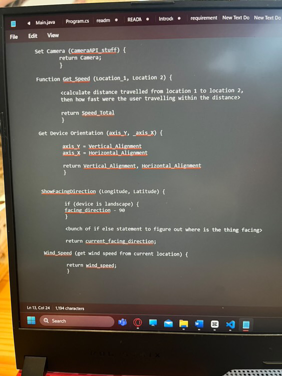

### 2.4 Main Web App Screen Layouts
Below are the core 3 screen layouts for the web app, these core screen layouts will be present on desktops, tablets, and mobile phones for the geoview web app.

**Desktop Screen Layout**

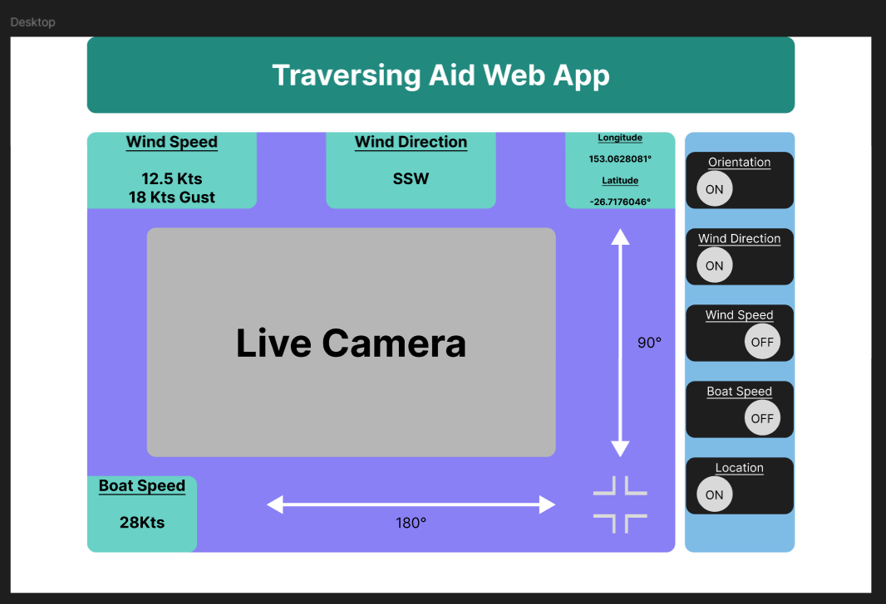

**Tablet Screen Layout**

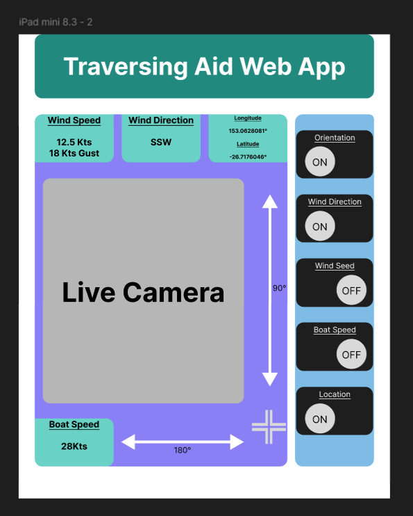

**Mobile Screen Layout**

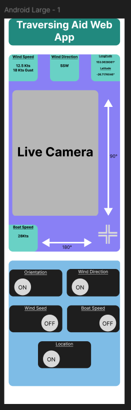

### 2.5 Development of Front-End for Web Application ###
The part of the web application that the user will interact direclty with will be the fron-end of our mobile app. I will generate this part for the user to interact with through using HTML for the web page and Cascade Style Sheeting for the visual appeal of the user interface.

The frontend of the web application will include the following contents:

    1. A start page will appear with a button to start the main function of the app, this page will also showcase a brief introduction to what the web app is and how to use it.

    2. After the button is pressed, the webpage will display the main function of the app, being a live web recording having overlays on the screen of key metrics.

    3. Each key metric will have an on and off toggle for the user to turn whatever metrics they wish to use on.

    4. The camera from the user's device will be used, requiring permission from the user of the web application.

### First Front-End Iteration ###

So far the below image is what has been created regarding the intorduction web page for our web application:

**Introductory Web Page**

‌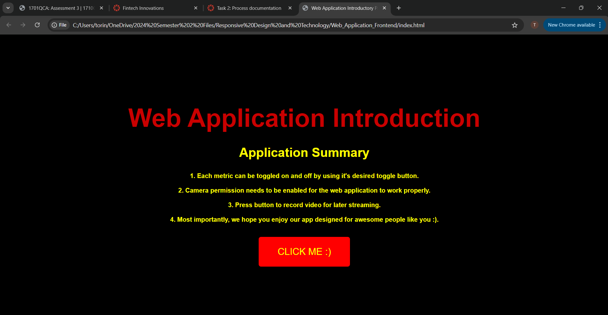

There is still significant work to be done on the front-end, but good progress has been made with the web application so far. The first task was to create a simple introductory webpage, which was straightforward in terms of code development.

The first step was structuring the HTML, starting by declaring the document as HTML using '!DOCTYPE html'. In the 'head' section, meta tags were added to set the character encoding to UTF-8, ensure mobile responsiveness (via the viewport tag), and maintain compatibility with Internet Explorer (X-UA-Compatible). The title of the webpage was set to "Web Application Introductory Page," external stylesheets were linked, and additional CSS was included through an internal style block for layout and appearance.

Next, CSS styling was developed using a flexbox layout to center the content. A black background was applied with Arial fonts. The headings were styled with different colors: h1 in semi-transparent red, and h2 and h3 in yellow. The button that redirects users to the next page has a black background with yellow text to make it stand out, rounded corners, a hover effect that changes it to red, and an outline when focused.

After styling, the HTML content was populated with a title ("Web Application Introduction"), a subheading ("Application Summary"), and instructions explaining that metrics can be toggled, camera permission is required, users can record videos, and a note encouraging users to enjoy the application.

Finally, the interactive button labeled "CLICK ME :)" serves as an important feature, redirecting users to the "main.html" page when clicked. This button acts as a gateway to the main content of the web application, with the overall page providing a user-friendly interface and clear instructions.

**Code developed for the "Web Application Introductory Page"**

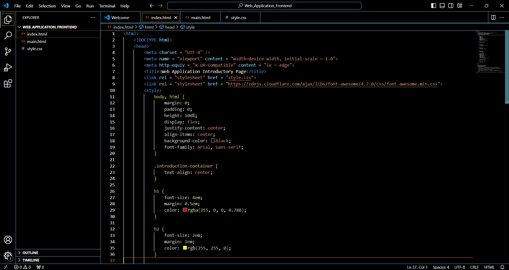

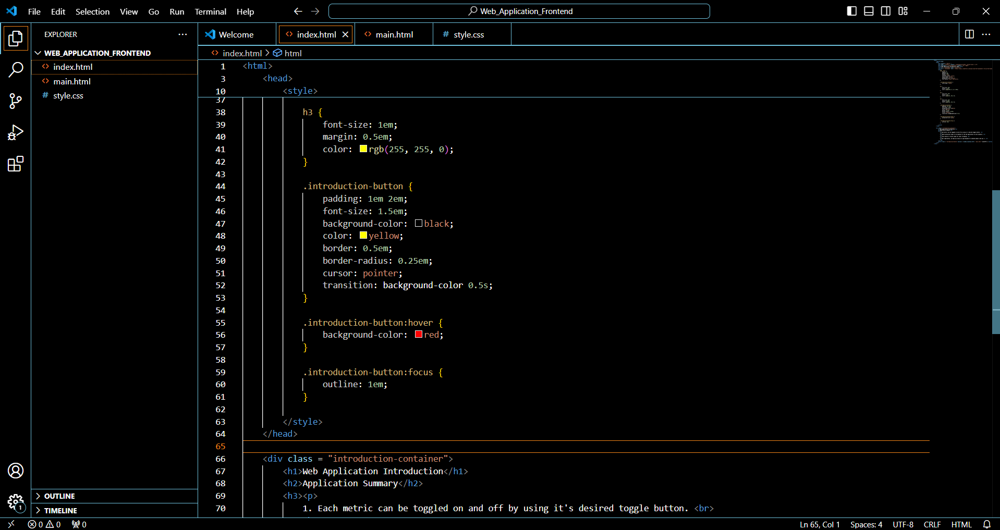

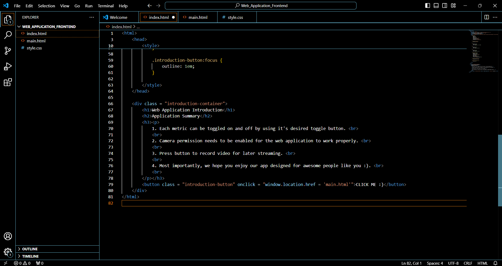

The below two images are what has been created so far in terms of the development of the main page for our web application:

**Main Web Page**

‌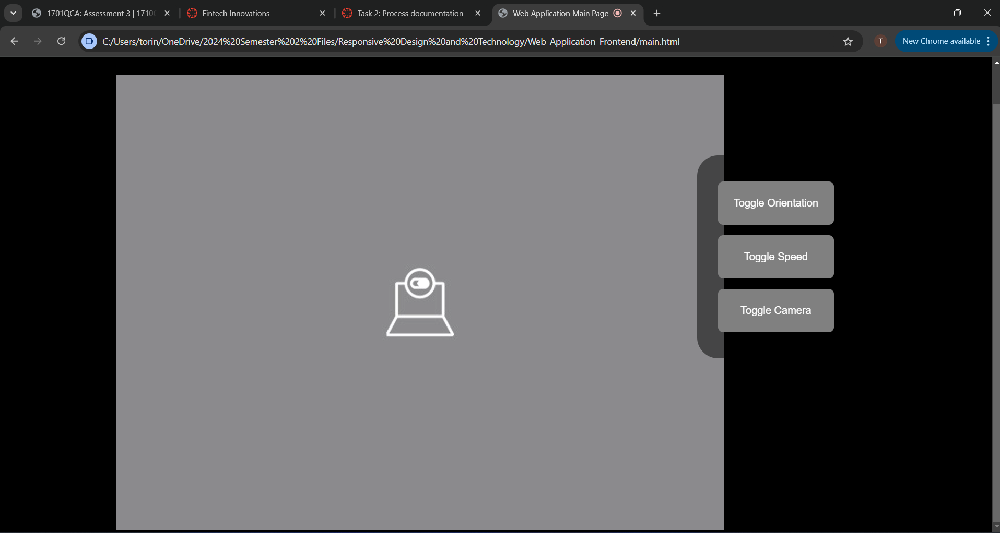

‌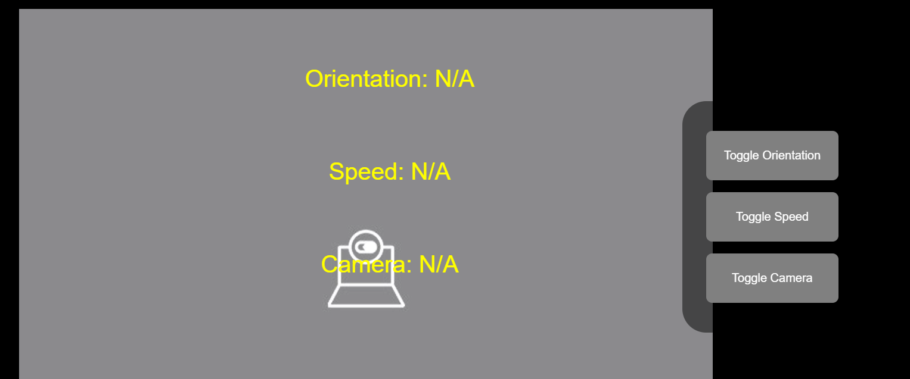

To create the main web page, I started by declaring the document as HTML using '!DOCTYPE html' and set the language to English, as it was defaulting to French in Google settings for unknown reasons. The page includes meta tags for character encoding, mobile responsiveness, and Internet Explorer compatibility, similar to what was done on the introductory page. Finally, the page title and CSS were defined in the 'style' block. For the CSS styling, the page features a black background with white text in Arial font. Flexbox is used to center content, and the container and video elements occupy 80% of the page. The metrics (orientation, speed, and camera status) are overlaid on the video and can be toggled on or off via buttons. The main page utilises a 'video' element to display a live stream from the user's camera (with permission) when the page loads. This then proceeds to the '.overlay' div which contains three hidden metric elements (orientation, speed, and camera), displayed over the video feed with yellow text. By default, the metrics show "N/A" to indicate that they are either off or inactive. The three toggle buttons allow users to show or hide the orientation, speed, and camera metrics by using the 'toggleMetric()' function. Additionally, the 'startVideo()' function requests camera access to display the live video, while 'toggleMetric()' toggles the visibility of the metrics.

**Code developed for the "Web Application Main Page"**

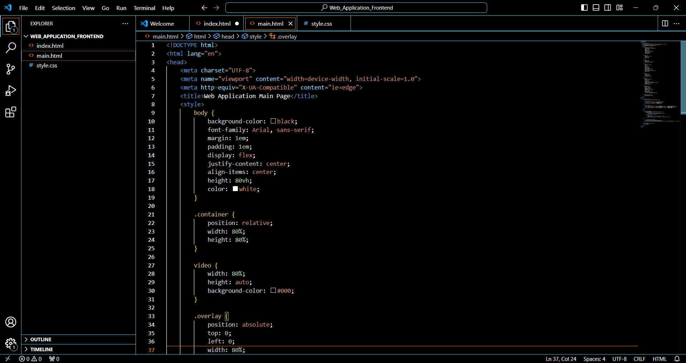

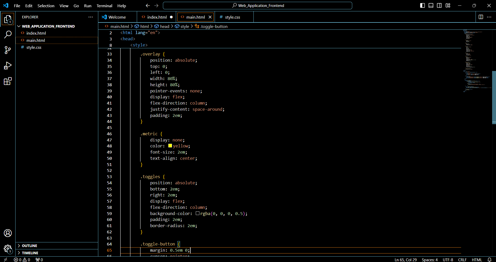

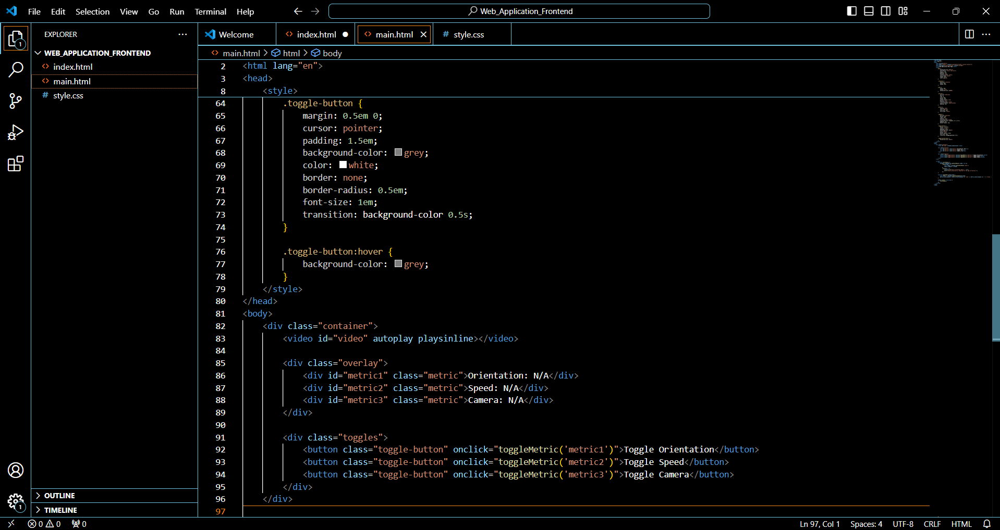

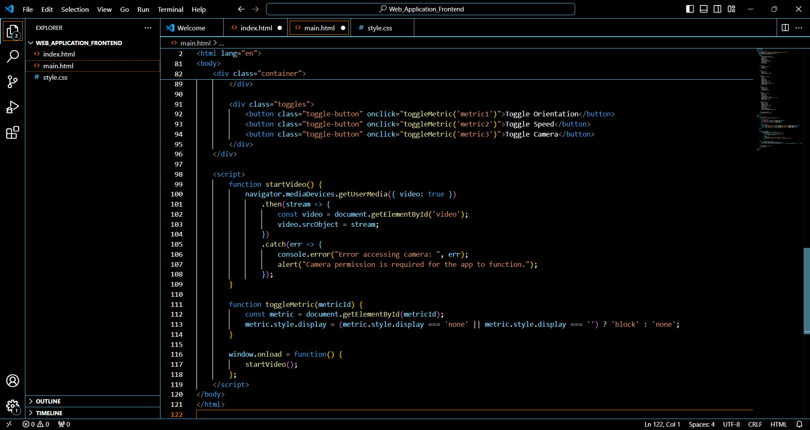

### What To Do Now? ###

Moving forward, the majority of development will focus on the main web page. There is still significant work to be done, particularly with overlaying key metrics such as speed, orientation, and recording functionality, as well as potentially adding wind direction. Additionally, these overlay elements need to be repositioned so that they align with the edges of the screen, rather than being centred in the middle when toggled off (N/A).

### Second Front-End Iteration ###

**Main Web Page**

Changes made include the following:

    -Further editing the toggle buttons to make them more neat and presentable.

    -Have the toggle buttons display enabled and N/A within the actual button rather than in the middle of the screen.

    -Other small details have been edited like the display of the live camera box.

    -A main title was added to the top middle of the screen displayed in red for clear visualisation.

    -Layouts of each key feature on the main web page have been moved around accordingly.

**Modified Code for the "Web Application Main Page"**

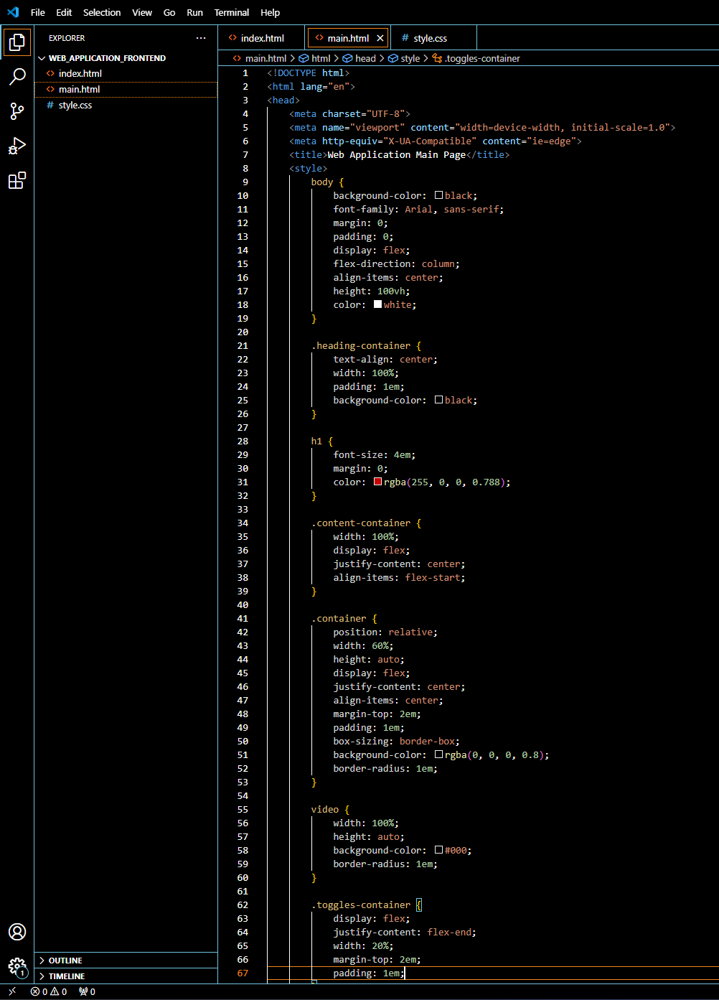

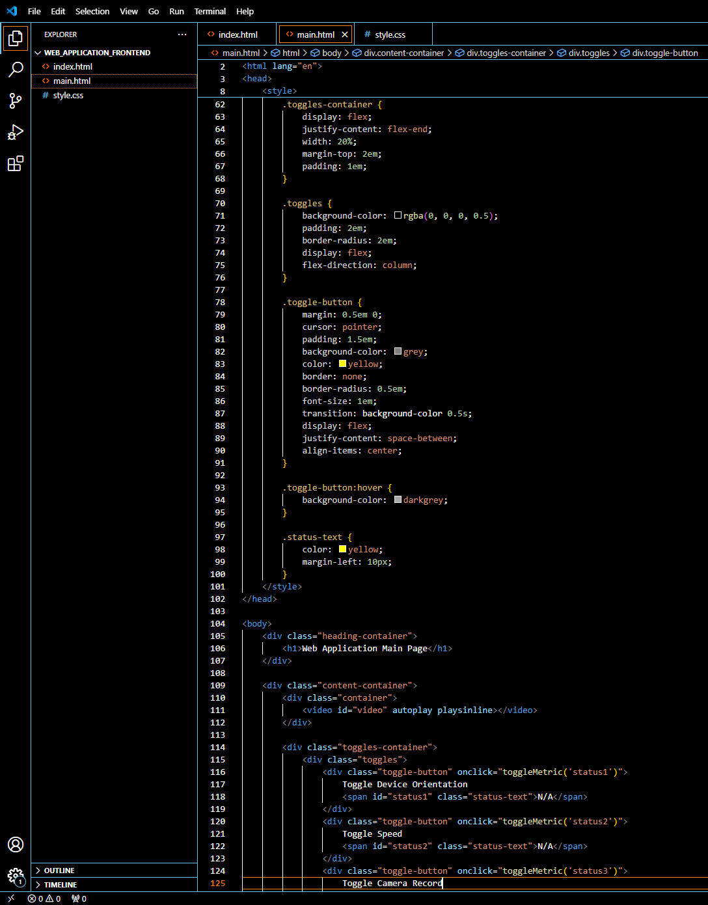

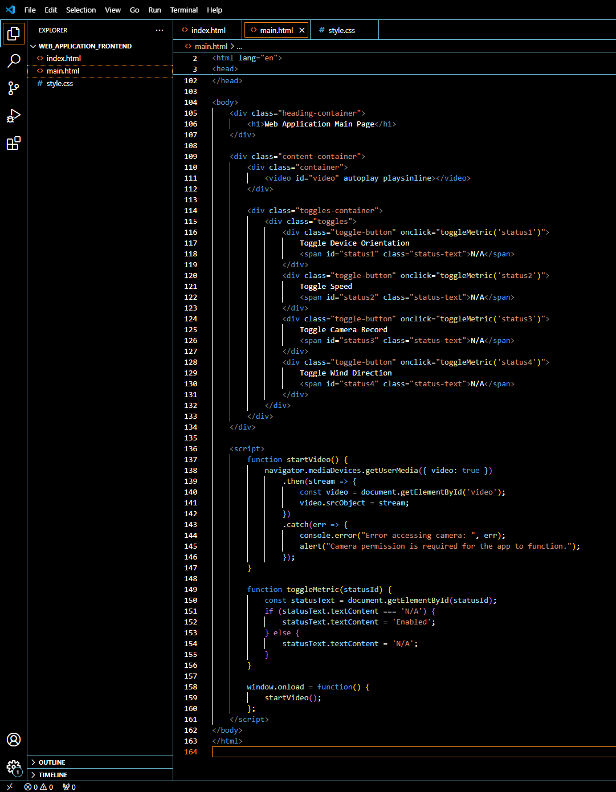

**Current Main Page**

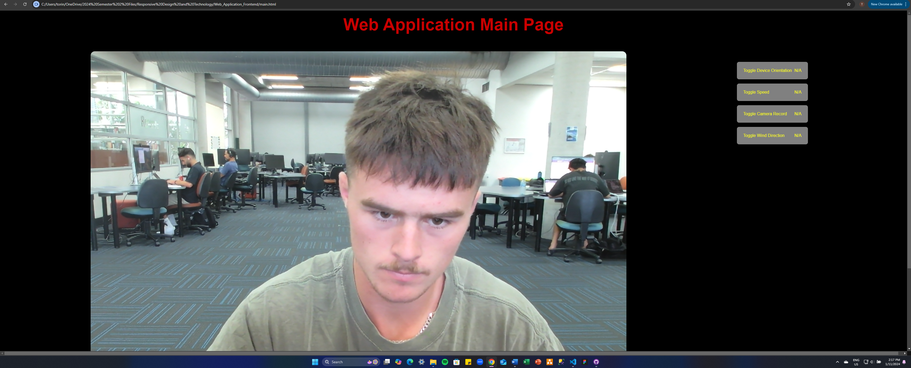

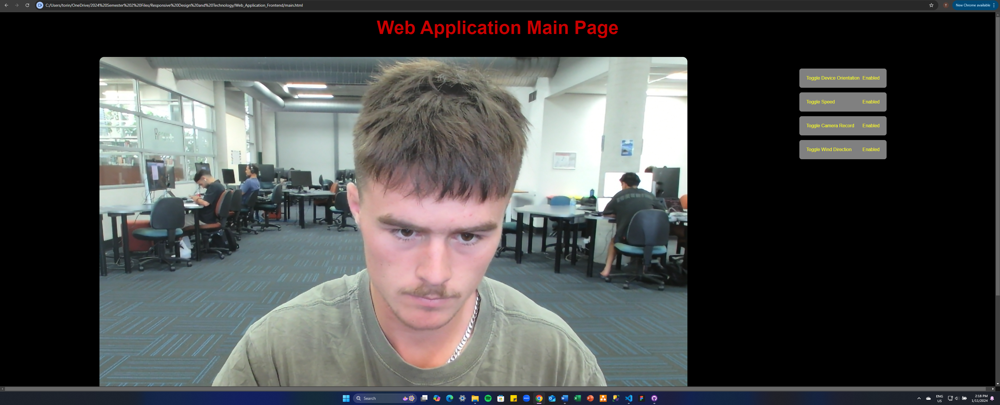

### Whats Next? ###
Looking ahead, the button features still require an overlay display on the live camera recording when activated. Additionally, the APIs for each key metric need to be organised; however, this falls outside my responsibilities, as my focus is on the front end rather than the back end and its functionalities. My next steps for the web application will involve finalising the overlay displays for device orientation, wind direction, and speed (kph) on top of the live camera feed.

this is how to do it.