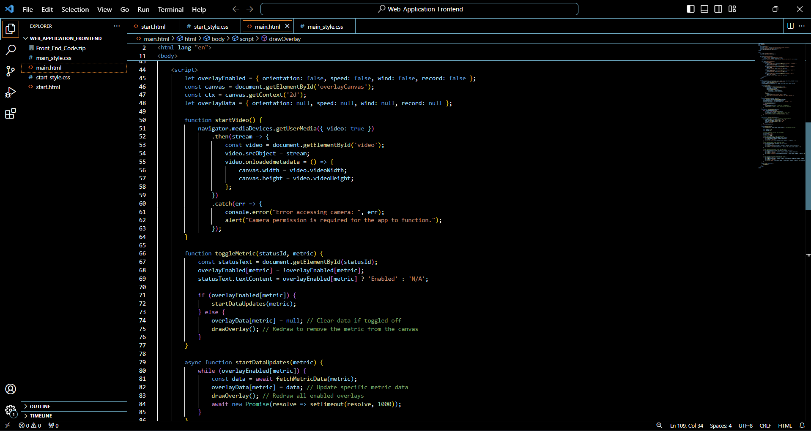
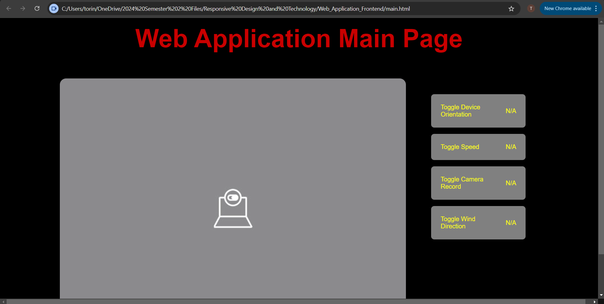
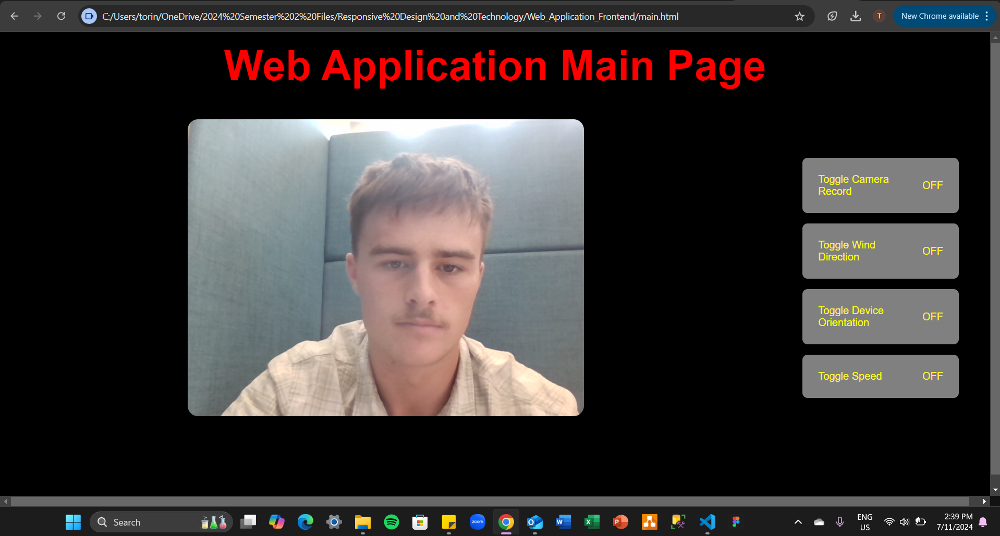
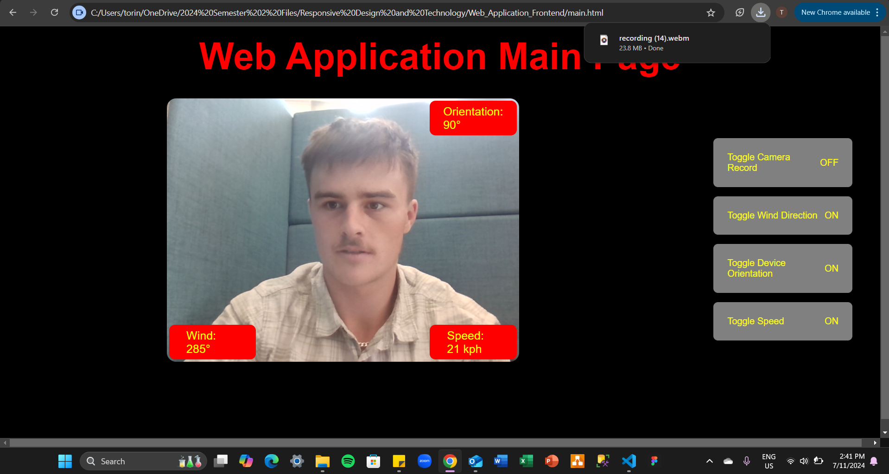
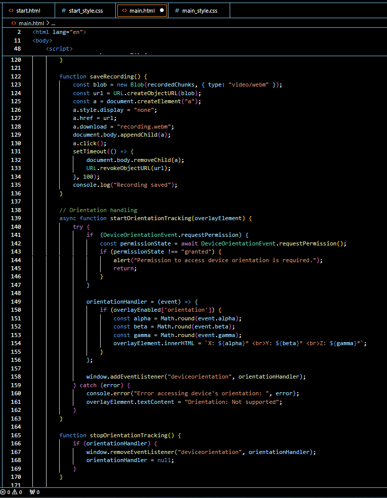
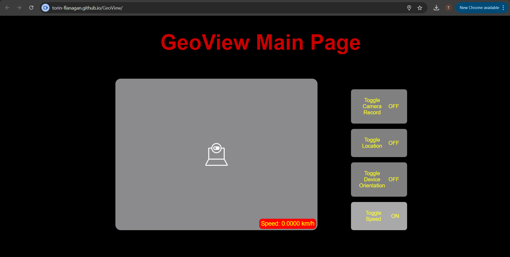

# Responsive Design and Technology Task 3 #
### Mobile web app that displays a savable live recording with key metric overlays (orientation, location, and speed) ###

## 1. Conceptualisation ##
### 1.1 Design Intent ###
The web app is designed for use as an online application. When users access the web app, they’ll be prompted to grant access to certain device components. With this access, the app can display real-time outputs on the user’s screen. Importantly, the web app isn’t tailored to a specific purpose; rather, it offers flexible features that users can adapt to their own needs and interests. For example, users may choose to use it while sailing, mountain biking, flying, snowboarding, and more.

### 1.2 Research ###
Through researching similar projects found online, we gained a deeper understanding of what Sean, Jay, and I aim to achieve with this project, as well as how we plan to accomplish it. The insights gathered during this phase will strongly influence our development goals and guide each stage of the process. This research informs not only how we design the web interface but also how it interacts with users’ phones and which data components we aim to access from the devices. The impact of this research will become more evident throughout this process journal.

### 1.2.1 Related Project 1 ###

This project employs a similar concept to the one we’ve developed. However, the smart wheelchair includes built-in sensors within the seat, which collect data continuously in the background while the patient is using it. The data gathered offers insights into the patient's seating habits and the energy required to maintain proper posture. An additional feature for the smart wheelchair could be fall detection, alerting the patient to a potential tipping risk, allowing them time to seek assistance. These key features enable caregivers or family members to monitor the patient remotely, especially when they’re not in close proximity. One idea we could adopt from this project is the ability to remotely access data, allowing for seamless monitoring from any location.

**Reference:** Deshpande, C. (2020, December 21). Top 10 Ultimate Internet of Things (IoT) Projects. Simplilearn.com. https://www.simplilearn.com/internet-of-things-iot-projects-article

### 1.2.2 Related Project 2 ###

This project features a smartphone application designed to assess road conditions using data from the accelerometer, gyroscope, and GPS. According to the research, machine learning techniques are applied to predict road quality based on this data. By leveraging the RoadSense app, the need for specialised vehicle sensors is eliminated, making the solution more scalable. The app’s goal is to provide users with real-time road condition information before travel, potentially aiding improvements in road infrastructure. The study emphasises that combining data from the gyroscope and accelerometer was the most effective approach, as these sensors can detect vehicle movements caused by potholes, rough surfaces, and other road irregularities. This finding is highly relevant to our project, as the accelerometer and gyroscope are particularly effective in detecting sudden movements such as shakes, bumps, and tilts. These factors are critical in bike and motorbike usage, suggesting these sensors could be valuable for enhancing our project.

**Reference:** Allouch, A., Koubaa, A., Abbes, T., & Ammar, A. (2017). RoadSense: Smartphone Application to Estimate Road Conditions Using Accelerometer and Gyroscope. IEEE Sensors Journal, 17(13), 4231–4238. https://doi.org/10.1109/jsen.2017.2702739

### 1.2.3 Related Project 3 ###

The third related project employs a camera to mimic the appearance of the user, similar to a mirror but with a unique twist. Instead of a reflection, the artwork, titled Portraits Nebula, uses flip-discs (small, dime-sized circles that can rotate up to 60 times per second via electromagnets). This interactive kinetic artwork captures a brief clip of the user’s interactions through a camera, which it then replays later, cycling through every recorded portrait while the device is active. In relation to our web app project, this artwork demonstrates a creative use of a camera that aligns with our design concept, which could involve capturing or recording user interactions with the app.

**Reference:** Digital Kinetic Artwork - Portraits by BREAKFAST. (2024, July 16). BREAKFAST. https://breakfaststudio.com/works/portraits-nebula

### 1.2.4 Related Project 4 ###
‌

The suit, named Ceres, is a grey, jumpsuit-like piece of wearable technology that, from a distance, appears to vibrate randomly as the user moves. However, on closer inspection, the jumpsuit is equipped with small buzzers positioned near the user’s shoulder blades and back, delivering a buzzing sensation to the skin. These vibrations are triggered by microcontrollers connected to NASA's Near Earth Object API, and they indicate when asteroids are approaching Earth’s orbit. This project demonstrates how geographic data (asteroid proximity) can be displayed through a responsive design, such as vibrations in the suit. This approach highlights the potential for creatively interpreting geographic information. In relation to our project, a similar concept could involve using geographic data to track and record paths or routes the user takes, enabling future reference through an API-powered integration.

**Reference:** Plaugic, L. (2018, April 14). These three designers make wearables that measure the world around you. The Verge. https://www.theverge.com/2018/4/14/17233430/wearable-media-fashion-tech-nyc-ceres-jumpsuit-interactive

### 1.2.5 Related Project 5 ###

A gyroscope with 360-degree rotational capability was developed, controlled via a software GUI and joystick. This project is applied in fields such as flight simulators, focusing on a gyroscopic perspective integrated with software development. While currently in prototype form, it serves as a concept for potential investors interested in scaling the design into a full-sized, real-time application. For our project, this concept demonstrates a potential use of gyroscope data in a similar way. However, our approach would involve utilising the phone’s built-in gyroscope to display the user’s tilt angle on the web app. Future development could expand gyroscope functionality to include gesture-based navigation, motion controls, or augmented reality features that respond to the user’s movements.

**Reference:** Svensson, M. and Johannesson, J. (2013). The Human Gyroscope. [PDF] p.45. Available at: https://www.diva-portal.org/smash/get/diva2:647956/FULLTEXT01.pdf [Accessed 8 Sep. 2024].

### 1.2.6 Related Project 6 ###

The image above shows a simple web page that displays the z-axis, x-axis, and y-axis of the user's phone once permission is granted to access the device's hardware. The webpage uses an Inertial Measurement Unit (IMU), which combines 3-axis accelerometers, 3-axis gyroscopes, and sometimes 3-axis magnetometers to provide a more accurate display of the device’s orientation. Additionally, the IMU performs onboard analysis, combining these different sensors with signal processing to produce a smooth, reliable output. The API works by adding an event listener that listens for the 'deviceorientation' event. This event includes three variables representing the z-axis, x-axis, and y-axis. The event handler then updates the text displays of these rotation values in the web app. This API is particularly valuable for our project, as one of its core components (the gyroscope) relies directly on the Device Orientation API. Together with the geographic location and camera functionalities, the gyroscope plays a crucial role in the design of our web app. We anticipate that this API will be essential for our project, as it meets our needs for the gyroscope. However, we plan to refine and enhance its functionality and appearance to better align with the specific requirements of our web app.

**Link To Access Device Orientation API:**

https://tgifford-usc.github.io/WebAPIExamples/

**Reference:** Log In to Canvas. (2024). Usc.edu.au. https://learn.usc.edu.au/courses/27670/pages/8-dot-2-%7C-device-orientation-api?module_item_id=632692

### 1.2.7 Related Project 7 ###

Similar to Related Project 6, this image displays a simple web page that shows a live camera feed (top). When the 'Take photo' button is pressed, the web page captures a photo of the user and displays the image in a static form (bottom). However, the web page does not save the photos and only holds the most recent photo taken after the 'Take photo' button is triggered. This webpage works by treating the device's cameras as video sources, generating a live video stream directly from the camera. The process begins by using the Media Capture API to access the camera's video stream. This stream is then attached to a HTML video element, allowing the display of the live feed and extraction of individual frames. A final step involves rendering a captured frame onto a HTML canvas element, which is then converted into an image format, such as PNG. From there, the captured frame can be manipulated or processed as required. In relation to our mobile web app, the Media Capture API will likely be used as it provides results very similar to what we aim to design for the web app. However, we anticipate that this API will be modified and adapted to better suit the specific needs of our app. At this stage in the design, it is difficult to predict exactly what changes might be needed to customise the Media Capture API for our use.

**Link To Access Media Capture API:**

https://tgifford-usc.github.io/WebAPIExamples/

**Reference:** Log In to Canvas. (2024). Usc.edu.au. https://learn.usc.edu.au/courses/27670/pages/8-dot-3-%7C-media-capture-api?module_item_id=632693

### 1.2.8 Related Project 8 ###

Once again, another API is being used here, this time the Geolocation API, which displays your current latitude and longitude once the 'Show my location' button is pressed on a simple web app. Like the previous APIs, this webpage is quite basic, leaving ample room to customise the API to better suit our web app project. The way this API works is by describing the user's location using the GeolocationPosition object, which contains a GeolocationCoordinates object inside. The GeolocationPosition instance has two main properties: a coords property, which holds the GeolocationCoordinates instance, and a timestamp property, which contains the timestamp (in Unix time, measured in milliseconds) of when the position data was obtained. The GeolocationCoordinates object provides several properties, but the key ones used in our case are latitude and longitude. Other information available from the GeolocationCoordinates object includes altitude, speed, the direction the device is facing, and accuracy measures for the altitude, longitude, and latitude data For our web app project, this API meets the basic requirements for geographic location functionality. However, it will need adjustments and modifications to better align with our specific goals. Additionally, it must be optimised to integrate smoothly with the rest of our web app.

**Link To Access Geolocation API:**

https://developer.mozilla.org/en-US/docs/Web/API/Geolocation_API/Using_the_Geolocation_API

**Reference:** Using the Geolocation API Web APIs, MDN. (n.d.). Developer.mozilla.org. https://developer.mozilla.org/en-US/docs/Web/API/Geolocation_API/Using_the_Geolocation_API

### 1.3 Other Research ###

**The Following Paragraph Relates Directly To This Video:**

(https://www.youtube.com/watch?v=wPpuBOSU7_w)

Further research into how a gyroscope in a smartphone works reveals that its primary function is to measure the device's angular velocity, which means it tracks rotational angles over time. Although this concept is simple in theory, its practical applications in smartphones are vast. For instance, the gyroscope is used for functions like straightening photos during editing, improving low-light photography through optical image stabilisation, and enhancing augmented reality experiences by accurately displaying objects in a given environment. In summary, the gyroscope tracks changes in the smartphone's angular velocity, enabling a wide range of functionalities that rely on motion and orientation, leading to a wide variety of endless opportunities using a gyroscope.

**Reference:** CNET (2020). The Hidden Story of Your phone’s Gyroscope. [online] www.youtube.com. Available at: https://www.youtube.com/watch?v=wPpuBOSU7_w.

### 1.4 Possible Design Concepts ###

### Design Concepts Towards Location API ###
From obtaining the user's location, the web app could work in relation to travelling and maps, telling the user where their current location is on a map. Another possibililty could be to use the phones location to find something, this would be very similiar to Apple's air tag product in a sense or the find my iphone app. A phones location could also be used in a sense for finding what's near the phone istelf, such as locating restaurants near your current location. Lastly, location from the user's phone could be used to store things based on the location, such as geotagged photos, memories, or sounds.

**Pros:** Obtaining the user's location means a web app can offer real-time mapping to help users navigate or find their current location. This can also enable tracking of lost objects and provide personalised, location-based recommendations for nearby places. Additionally, location data can be used for geotagging, allowing users to store and organise memories based on where they were created.

**Cons:** Use of location data in a web app can lead to privacy concerns due to users feeling uncomfortable sharing their current whereabouts. This can also drain battery life and pose security risks if the data is leaked or hacked. Inaccurate location data, such as in areas with poor GPS signal, can lead to unreliable information. Lastly, frequent permission requests regarding location access has the ability to frustrate users, leading to less app use.

### Design Concepts Towards Camera API ###
With using the user's camera, the web app can have the ability to take photos or videos either with the user's input or automatically without. Scanning of QR codes is another possibility that can be achieved through obtaining the user's camera. A more discrete feature that could be used within the web app could be for the user to either check their face or body through using the device's camera. The phone's camera can also be used as a telescope if used within the right context, or it could even be used for obtaining colour schemes from pictures such as taking a photo of a susnet or a painting.

**Pros:** There are various benefits from using the camera of a device, these can include allowing the user to capture photos or videos either manually or automatically, giving flexibility for creative and practical purposes. It can also enable scanning of QR codes to quickly obtain information/payments, the camera can also serve as a personal tool in relation towards checking one's face or body. Versatility of the camera allows it to function like a telescope bringing magnified views, or even as a tool towards extracting colour schemes from images to enhance creative and design possibilities.

**Cons:** Just like obtaining the user's location, using the camera also raises privacy concerns, especially in relation to automatic photo or video captures. Camera access can pose high security risks if not properly secured, these risks can include unauthorised recordings or surveillance. Asides from privacy concerns, use of the camera will also drain battery life much like the location API. On top of this, misuse or unintended camera functions can lead to accidental content creation, leading to user dissatisfaction.

### Design Concepts Towards Gyroscope API ###
The last API use will be in relation to the gyroscope, where the gyroscope's benefits can include obtaining the device's level status from it's inbuilt gyroscope. It can also be used for 3D scanning or photogrammetry through ensuring an accurate orientation, which then improves capture stability and facilitates the creation of precise 3D models from multiple angles. Very similiar to the purpose of a gyroscope in 3D scanning and photogrammetry, it can also help to stabilise the use of the phone's camera. A gyroscope can even be used for augmented reality viewing such as NightSky, which is a stargazing reference app, where the user can explore a virtual representation of the night sky to identify stars, planets, constellations and satellites. Lastly, another design concept towards the gyroscope could be to include a shaking functionalitiy such as 'shake to play' or 'shake to win', which can be used to build up anticipation for the user or to create a random outcome.

**Pros:** Many benefits include providing the device's level status for use with a precise positioning or balance. Gyroscopes greatly benefit 3D scanning and photogrammetry through ensuring accurate orientation and stability. It also stabilises the phone's camera to enhance image and video capturing. Accurate movement tracking is enabled in augmented realities with the use of a gyroscope. A gyroscope can even bring greater engagement through interactive features, better improving the user experience.

**Cons:** Due to the gyroscope's reliance with device movement and orientation tracking, it can lead to inaccurate result if the sensor itself isn't calibrated correctly or if there is excessive shaking and instability. Once again battery life is also a concern if the gyroscope is continually used over an excessive time frame. Integrating a gyroscope functionallity has the ability to detract the user's overall experience and will require a careful, thoughtout design.

### Ways Of Using A Screen ###
There are various ways to interact with screen-based apps. One common method is to gather information, such as using search engines like Google or Firefox. Another use is to communicate with others, either individually or in groups, through apps like Instagram, Facebook, or Snapchat. Screens are also used for financial transactions, such as mobile banking or payments via apps like PayPal or traditional banking apps. The possibilities for using a screen are limitless, with apps offering a range of functions that can combine multiple features or focus on a single purpose. Ultimately, how a screen is used depends on the user's needs and the task they are trying to accomplish.

### 1.5 Double Diamond Design Methodology (Discover and Define) ###

**Reference:** Elmansy, R. (2021, February 9). The Double Diamond Design Thinking Process and How to Use it. Designorate. https://www.designorate.com/the-double-diamond-design-thinking-process-and-how-to-use-it/

### Discover ###
During the discovery stage, the most effective approach to creating a final idea is to develop multiple concepts. By exploring different options, you can compare and refine these ideas, synthesising the best elements from each idea to form a cohesive final solution, which will then serve as the main concept or project.

The primary objective of this discovery phase is to gain a deeper understanding of the problem at hand by gathering insights and exploring the broader context surrounding the design challenge (UXPin, 2022). A crucial part of this phase involved researching examples of how similar APIs such as the camera, location, and gyroscope are used across various devices. Several key concepts emerged from Related Projects 2, 3, and 4, each offering unique perspectives. From Related Project 2, the idea of utilising the gyroscope and location APIs to assess real-time map conditions and path quality was particularly influential. Related Project 3 offered insights into leveraging the camera API to record user interactions with the web app for future playback. Lastly, Related Project 4 provided inspiration for using APIs to track and display users' paths on the web app via their smartphones.

In conclusion, these potential ideas will be further analysed and synthesised, incorporating key elements from each project to develop a web app that effectively uses the camera, location, and gyroscope APIs to enhance user interaction and engagement.

**Reference:** UXPin. (2022, September 19). Double Diamond Design Process – The Best Framework for a Successful Product Design. Studio by UXPin. https://www.uxpin.com/studio/blog/double-diamond-design-process/

### Define ###
During this stage, the most important and vital aspects in relation to the project are selected and refined to best meet the projects requirements.

Key Questions to answer in the define phase include:

    -What is the purpose of this project?

    -Why is this web app needed?

    -Who will be using this web app?

    -What is the scope of this project?

    -How will this project be implemented?

    -What problems does this project aim top solve for the users?

    -What are the constraints and limitations for this web app?

    -When will the web app be used by it's users?

**Camera, Gyroscope, And Location Web App**

The original idea of creating a general-use web app featuring a camera, orientation display, and location tracking led to the realisation that the app lacked a specific purpose or clear use case, which made it less compelling for users. The project was then refocused to expand and define these features in a more targeted way, leading to the development of a more useful and purposeful app. This shift in direction ensured the app would offer more value and cater to user needs in a more practical and engaging manner.

**Traversing Aid Web App**

Expanding on the previous project idea, we finalised the concept of the web app to assist sailors while they are out at sea with their boats. The app now incorporates the use of a camera, gyroscope, wind speed and direction, geolocation, and ship speed. This development provides the app with a clear purpose: to deliver essential information about the boat, its location, and the surrounding environment. As a result, the target audience is defined as sailors, and the app’s main goal is to enhance navigation, support decision-making, and simplify the sailing experience.

### 1.7 Final Design Concept ###
The Traversing Aid Web App will provide sailors with real-time data through a live video feed of the boat’s surroundings, complemented by key statistics such as orientation (X and Y axis), wind direction and speed, boat speed (knots), and location (longitude and latitude). By utilising APIs for the camera, gyroscope, geolocation, wind, and speed, the app offers sailors a comprehensive view of these essential factors that affect the vessel. It is designed to enhance navigation, decision-making, and simplicity while sailing, featuring an intuitive, responsive interface that works across multiple devices (desktop, tablet, and phone). This makes it a valuable tool for both recreational and professional sailors.

The app will be used when a sailor needs a live display of critical statistics regarding their boat or when they wish to review the recorded data later. It will prove to be an invaluable tool, offering a live overview of the core elements that influence the vessel, ultimately improving the sailor’s ability to navigate and make informed decisions.

**Why A Traversing Aid Web App?**

These APIs provide a clear and straightforward representation of critical elements for a boat within a web app. By offering quick, easy access to essential data, the app allows users to efficiently analyse key factors affecting their vessel while at sea, enhancing their safety and improving their ability to respond to potential hazards.

**Rough Drawing Display Of The Traversing Aid Web App:**

## 2. The Body ##
### 2.1 Core Processes ###
    -External APIs are used to retrieve real-time data (e.g., weather, wind speed, and boat location).

    -Data is stored in variables within the code after being received.

    -Python is used to process and filter the data (e.g., calculating boat speed, tracking weather changes).

    -JavaScript handles the display of the processed data in the app's user interface.

    -JavaScript updates elements like live wind speed or the boat's position on the map in real time.

    -The combination of Python for backend data management and JavaScript for frontend display ensures smooth, real-time functionality for users.

### 2.2 Core Process Relationships ###

### 2.3 Pseudocode For the Web App ###

### 2.4 Main Page Screen Layouts ###
Below are the 3 essential screen layouts for the web app, these core screen layouts will be present on desktops, tablets, and mobile phones for the Traversing Aid Web App.

**Desktop Screen Layout**

**Tablet Screen Layout**

**Mobile Screen Layout**

### 2.5 Change Of Web App Purpose ###
At this stage of development, Sean, Jay, and I presented our project idea to Toby and Fin for Task 2. Based on the feedback we received, our idea was confirmed and agreed upon. However, we were advised to shift our concept from an app designed to assist sailors at sea to a more general-use app, incorporating key metrics such as orientation, speed, location, and camera recording. To clarify, our final concept that we will be pursuing is now known as GeoView, a live camera recording app that allows users to save footage, with key metric overlays for orientation, speed, and location in real-time.

### 2.6 Development for Web Application ###
The part of the web application that the user will interact with directly will be the front-end of our mobile app. I will develop this interface using HTML and JavaScript for the web page functionality, and CSS for the visual appeal and design of the user interface.

The front-end of the web application will include the following features:

    1. Start Page: The initial page will display a button to activate the main function of the app. It will also provide a brief introduction explaining the instructions on how to use the web app properly.

    2. Main Functionality: Once the button is pressed, the page will transition to display the core feature of the app (a live video feed with overlays showing key metrics).

    3. Metrics Toggle: Each key metric will have an on/off toggle, allowing the user to choose which metrics they wish to display or hide.

    4. Hardware Access: The web app will use certain hardware of the device, requiring the user to grant permission in order to use the web app properly.

This front-end design ensures a simple, user-friendly experience, allowing users to easily access and customise the live feed with relevant information.

### First Iteration ###
So far the below image is what has been created regarding the intorduction web page for GeoView:

**Introductory Web Page**

‌

There is still significant work to be done on the front-end, but good progress has been made with the web application thus far. The first task was to create a simple introductory webpage, which was relatively straightforward in terms of code development.

The initial step involved structuring the HTML, starting with the declaration of the document type using !DOCTYPE html. In the head section, meta tags were added to set the character encoding to UTF-8, ensure mobile responsiveness (via the viewport tag), and maintain compatibility with Internet Explorer (using X-UA-Compatible). The title of the webpage was set to "Web Application Introductory Page," external stylesheets were linked, and additional CSS was included through an internal style block for layout and appearance.

Next, CSS styling was developed using a flexbox layout to centre the content. A black background was applied, with Arial fonts used for text. The headings were styled with different colours: h1 in semi-transparent red, and h2 and h3 in yellow. The button that redirects users to the next page was styled with a black background and yellow text to make it stand out, rounded corners, a hover effect that changes the button to red, and an outline when focused.

After styling, the HTML content was populated with a title ("Web Application Introduction"), a subheading ("Application Summary"), and instructions explaining that metrics can be toggled, camera permission is required, users can record videos, and a note encouraging users to enjoy the application.

Finally, the interactive button labelled "CLICK ME :)" serves as an important feature, redirecting users to the "main.html" page when clicked. This button acts as a gateway to the main content of the web application, providing a user-friendly interface with clear instructions.

**Code Developed For The "GeoView Introductory Page"**

The below two images are what has been created so far in terms of the development of the main page for our web application:

**Main Web Page**

‌

‌

To create the main web page, I started by declaring the document as HTML using !DOCTYPE html and set the language to English, as it had defaulted to French in Google settings for unknown reasons. The page includes meta tags for character encoding, mobile responsiveness, and Internet Explorer compatibility, similar to the approach used on the introductory page. The page title and CSS were defined in the 'style' block.

For the CSS styling, the page features a black background with white text in Arial font. Flexbox is used to centre the content, and both the container and video elements occupy 80% of the page. The metrics (orientation, speed, and camera status) are overlaid on the video feed and can be toggled on or off via buttons.

The main page utilises a video element to display a live stream from the user's camera (with permission) when the page loads. This then transitions to the .overlay div, which contains three hidden metric elements (orientation, speed, and camera), displayed over the video feed with yellow text. By default, the metrics show "N/A" to indicate that they are either off or inactive. The three toggle buttons allow users to show or hide the orientation, speed, and camera metrics by using the toggleMetric() function. Additionally, the startVideo() function requests camera access to display the live video, while toggleMetric() toggles the visibility of the metrics.

**Code Developed For The "GeoView Main Page"**

### What To Do Now? ###
Moving forward, the majority of development will focus on refining the main web page. There is still significant work to be done, especially with overlaying key metrics such as speed, orientation, and recording functionality, as well as potentially adding wind direction. Additionally, the overlay elements need to be repositioned so that they align with the edges of the screen, rather than being centred in the middle when toggled off (displaying "N/A").

### Second Iteration ###

**Main Web Page**

Changes made include the following:

    -Further editing the toggle buttons to make them more neat and presentable.

    -Having the toggle buttons display enabled and N/A within the actual button rather than in the middle of the screen.

    -Other small details have been edited like the display of the live camera box.

    -A main title was added to the top middle of the screen displayed in red for clear visualisation.

    -Layouts of each key feature on the main web page have been moved around accordingly.

**Modified Code For The "GeoView Main Page"**

**Current Main Page**

### Whats Next? ###
Looking ahead, the button features still need an overlay display on the live camera feed when activated. Additionally, the APIs for each key metric need to be organised, though this task falls outside my responsibilities, as my focus is on the front-end rather than the back-end and its functionalities. My next steps for GeoView will involve finalising the overlay displays for device orientation, wind direction, and speed (kph) over the live camera feed.

**Group Discussion**

After completing the second iteration of work on GeoView, I organised a meeting with Sean at the UniSC library to discuss our next steps. We outlined the tasks for both the front-end and back-end development. My next focus for the front-end will be linking each API, enabling an overlay on the live camera feed that appears when toggled on and disappears when toggled off. Meanwhile, Sean and Jay will work on identifying and integrating the necessary APIs for key features, which will later be formatted for the front-end.

To link each API for the overlay display on the live camera feed, I’ll start by layering a HTML 'canvas' element over the 'video' element, allowing the API data to be displayed as an overlay. CSS will be used to position each overlay according to the toggle settings. Next, I’ll retrieve real-time data for each metric (e.g., device orientation, speed, wind direction) from JSON-format APIs, using JavaScript’s 'fetch' method at set intervals to keep the overlays updated. Once data is retrieved, the canvas context will format and display it over the live video, with a loop ensuring continuous updates. Finally, I’ll make the overlay responsive to the video size and add fallback text in case of API errors or data interruptions.

### Third Iteration ###

**Main Web Page**

Things added during this third iteration include the following:

    - Overlay boxes were added being red.

    - Overlay text was added inside the overlay box.

    - Each overlay is in a corner (not finished).

    - At the moment the overlays display mock data but the data will be replaced with the API endpoints.

    - Each overlay is linked with the associated toggle box and disappears when toggled off.

**Extended Code For Main Page**

**Current Main Page**

### Whats Next? ###
The next priority is to finalise the overlay displays on the live camera feed. Once these are fully functional, I can proceed with the next steps. After completing the overlays, the next major task is to ensure that when the recording button is activated, the website records and saves the video from the moment recording starts until it’s turned off. Additionally, it’s crucial to ensure that audio is recorded consistently from when the recording is toggled on until it is turned off.

### Fourth Iteration ###

**Main Web Page**

Things added during this fourth iteration include the following:

    - Overlay box (record, wind, speed, and orientation) displays were finalised.

    - The record functionality records and saves videos.

    - The record functionality records and saves audio.

    - The record functionality saves the recording as a webm file in downloads.

    - Permisission of the user's camera and microphone must be allowed for the recording overlay to work.

**Extended Code For Main Page**

**Current Main Page**

**Link for video:**
https://1drv.ms/v/c/1bb1864b7ca1ef51/EZuZhKnGdTFAm-P0rvATSHYBJsOuCpJznVfRF_tUt9xe9g?e=bK3Tnd

### Whats Next? ###
Moving forward, the next step towards GeoView is to implement the APIs for the wind direction, device orientation, and speed toggle features. These are the final major components needed to complete the website's core functionality. Once these APIs are fully operational, the application will undergo final checks to ensure all functions work as expected, followed by visual refinements and minor adjustments.

### Fifth Iteration ###

**Group Discussion**

Before implementing the necessary APIs for each toggle feature, Sean, Jay, and I held a group discussion to plan our next steps. We decided to use the Geolocation API to display both, the device's speed and location (instead of wind direction), and the Device Orientation API to show the device’s X, Y, and Z values. Additionally, we noted that the camera recording toggle would utilise the Media Capture API to record video and audio. After finalising our API choices, we agreed that once they were correctly implemented, we would need to use the Canvas function in HTML to ensure the recording includes the overlays in the saved video using JavaScript functionality.

**Main Web Page**

Things added during this fifth iteration include the following:

    - API for device orientation toggle.
    - API for location toggle.
    - API for speed toggle.
    - Required permission and privacy control handling.
    - Live feedback from the APIs.

**Extended Code For Main Page**

**How It Works**

The HTML Structure:

    -The HTML header <head> sets key metadata regarding character encoding, viewport settings for responsive design, and links the CSS style folder.

    -A title is displayed at the top using the following code 
.

    -The live streaming video is used through the device's camera from a HTML5 video element using <video id="video" autoplay playsinline muted>.

    -Each overlay is programmed to start hidden until toggled on (recordOverlay, locationOverlay, orientationOverlay, and speedOverlay).

    -For each button toggle and it's associated metric, it's used to either show or hide the overlay, updating the display.

The JavaScript Functionality:

    -Each metric's state is either enabled or disabled, which is tracked using overlayEnabled.

    -The toggleMetric() function toggles each metric's display based on the metric's start/stop tracking functions.

    -Camera access, video stream initialisation, and set up of MediaRecorder to capture the video are all achieved using startVideo().

    -Starting and stopping the video record, along with storing chunks in recordedChunks are done through using startRecording() and stopRecording().

    -Recorded video chunks are compiled and promted to be downloaded through using saveRecording().

    -Device orientation permission is requested through using startOrientationTracking(), listening for orientation events, updating the overlay and angles.

    -Tracking of the devices orientation is stopped by removing the orientation event listener with stopOrientationTracking().

    -By using navigator.geolocation.watchPosition(), the devices latitude and longitude are obtained and displayed in the overlay through using startLocationTracking().

    -Tracking of the device's location is stopped by clearing the geolocation watcher with stopLocationTracking().

    -Speed is calculated based on the devices changes in location through using navigator.geolocation.watchPosition() within startSpeedtracking().

    -Distance is then calculated between two geographical points (longitude and latitude) with the Haversine formula by using calculateDistance().

    -Distance in kilometres between two coordinates are computed using calculateDistance().

    -Speed is displayed in the overlay with four decimal places through using updateSpeedDisplay().

    -Speed tracking is stopped by clearing the speed watch with stopSpeedTracking().

    -When the page loads, startVideo is called to initialise the video stream from window.onload.

**Current Main Page**

**Sean's Version Of The Main Page**

Below is another version of the main page that Sean developed for our GeoView web application. In the future, we plan to merge his design with mine to create the final version. However, due to time constraints, we couldn’t combine both versions meaningfully. If more time had been available, we would have included Sean's enhanced visual elements, such as the speedometer for speed display and a red border around the live video feed to indicate recording. At the same time, my version’s elements, like the device's location display, API functionalities for each metric, and overall page styling, would also be part of the final design. Overall, my version covers each API’s functionality and the main page’s features more comprehensively, while Sean’s visual displays, specifically the speedometer and live camera recording indicator, are more advanced as mine currently use simple live text.

## 3. The Final Product ##
### What is the project ? ###

Below is the final prototype myself, Sean, and Jay have developed for our GeoView web application. This version includes both the start and main page incorporated as one HTML, as well as the CSS visual styling page also incorporated as one CSS file. The application works by displaying a live overlay on the camera recording, with real-time information based on the user’s selection of metrics. These metrics can be toggled on or off, and the overlays dynamically update to reflect the chosen data.

### Context Of Which The Project Exists ###

The Geoview web application would be applicable across a wide range of industries and environments, as it is versatile in terms of the metrics and live recording it can handle. This broad functionality means the application could be used in many different situations. To provide more specific examples, potential uses for our GeoView web application could include marine navigation and safety, adventure sports such as hiking, motorsports like car racing, and even urban exploration and city tours, among others.

In terms of target users, GeoView is designed for anyone who requires a live display of their current location, orientation, speed, or camera, as well as the ability to review recordings for future reference. Examples of target users include:

- Car racing drivers who may use the application to review race recordings and track significant metric changes that occurred during the race.

- Drone operators and aerial photographers who could use GeoView for safe and precise navigation, ensuring accurate positioning and recording.

- Research teams focused on environmental monitoring who require key statistics to be displayed for precise monitoring and documentation of environmental conditions.

One of the key problems or gaps that GeoView aims to solve is its ability to be used across various areas that require a savable live recording with critical metrics such as speed, orientation, and location. This flexibility allows the application to be adapted for a range of user needs, rather than being restricted to a single use case. For instance, research teams monitoring environmental changes could use GeoView to record their journey, capturing critical data such as latitude, longitude, and X, Y, Z orientation values. This capability allows them to review the journey in detail, providing a clearer understanding of the environmental changes they encountered. By showcasing real-time metrics alongside the recording, GeoView helps teams analyse their findings more effectively, offering a deeper insight into the conditions of the area.

### Current Solution And Limitations ###

The current solution we’ve developed for GeoView incorporates both a start page and a main page. On the start page, users are presented with instructions on how to use the web app, along with a button to navigate to the main page. Once on the main page, the core functionality of the app takes place. The live camera recording is displayed centrally on the screen, with four toggle buttons on the side: Camera Record, Location, Device Orientation, and Speed.

Each overlay appears in a corner of the live camera feed when toggled on, and disappears when toggled off. The data presented in each overlay is live, pulling real-time information from the user’s device through APIs for speed, location, orientation, and camera recording. When the Camera Record button is toggled on, the application records the visuals from the live camera feed until the button is toggled off. The recorded video, including both visual and audio data, is then available as a downloadable webm file for the user to review.

Limitations of the Geoview Web Application:

- Overlay Data Not Included In Recordings: Since the web application is currently a prototype, overlays do not appear in the saved recordings when the Camera Record button is toggled on. This means that, although the overlays are visible during live use, they are not captured in the recorded video. This would have been the final component to add for GeoView, but unfortunately we ran out of time to address this final feature.

- Geolocation API Conflict: Both the Location and Speed overlays rely on the same Geolocation API. As a result, there is a bug where activating one overlay causes the other to malfunction or time out. To address this, I believe it would be better to use a seperate API for the speed overlay, that way this bug would be comletely bypassed.

- Delayed Overlay Data: The real-time data presented in the location and speed overlays are somewhat delayed, meaning there is a lag in the updates of these metrics/ Despite efforts to optimise the speed of these updates, the delay persists due to limitations in the current prototype and limtied time constraints.

### Final HTML And JavaScript Code ###

### Final CSS Code ###

### Final Start Page ###

### Final Main Page ###

**Link For Video:**
https://1drv.ms/v/c/1bb1864b7ca1ef51/Eel4H6QTW6FJgiryo6UctAUBZgQ9vgi1hZYz4dTOyXz7XQ?e=ypDIiQ

**Link To Access GeoView:**
https://torin-flanagan.github.io/GeoView/

## 4. Reflection ##

In terms of future improvements, I would like to expand the variety of overlays to include metrics such as wind speed, temperature, humidity, and more.

I also wish that the real-time data for each overlay updated more quickly, as this would significantly enhance the overall functionality of the web application.

Overall, I am satisfied with the progress that myself, Sean, and Jay have made with the GeoView web application. It remains a complex and feature-rich project, utilising APIs, custom HTML, JavaScript, and CSS to deliver a fully functional interactive and responsive web application.

The most challenging aspect of developing the GeView web application was integrating and effectively using the various APIs. While the custom programming to ensure the APIs worked seamlessly with our web app wasn’t particularly difficult, getting the APIs to communicate properly with our system was a major hurdle. Another challenge was implementing the camera record button to save the recording as a file. This was particularly tough for me, as I had no prior experience in programming the saving of live video streams to files.

Despite these challenges, I thoroughly enjoyed this group project. It has provided me with valuable experience in JavaScript programming and working with APIs to retrieve real-time data to achieve the desired outcomes for the GeoView web application.